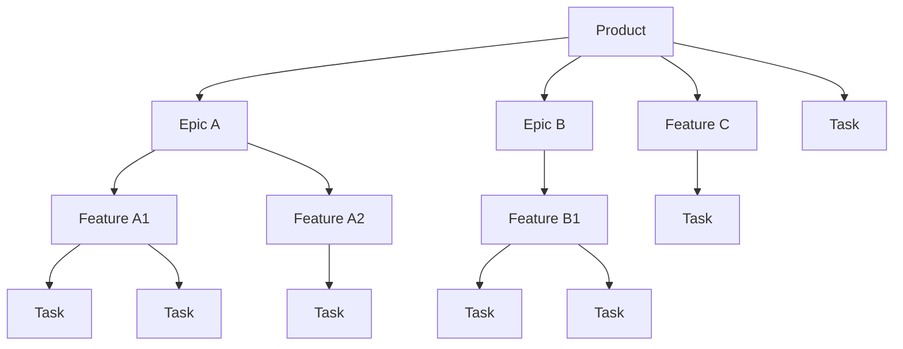

# Agenture — Claude Code Plugin Marketplace

A marketplace of Claude Code plugins for AI-assisted software development.

Agenture moves teams from ad-hoc AI use to a repeatable, review-gated lifecycle: **you write the specs and approve each gate, AI drafts the design, code, and tests from those specs.** The `agn` plugin implements that loop inside Claude Code.

## Install

Add the marketplace to Claude Code once, then install any plugin from it:

```
/plugin marketplace add AgentureHQ/agenture-loop
/plugin install agn@agenture
```

Restart Claude Code (or run `/reload-plugins`) and the `/agn:*` skills become available.

## The Agenture SDLC

Four-tier work hierarchy — a product breaks into epics, epics into features, features into tasks:



A product holds many epics, an epic many features, a feature many tasks. The hierarchy is open, not fixed: every level is optional one up. **Feature C** has no parent epic, and the top-level **Task** is ad-hoc — no parent feature or epic.

The lifecycle runs **define → design → plan → implement → validate**, plus maintenance skills. Each stage and the skill that drives it:

### 1. Define — *what & why*
`/agn:define <level>` where `<level>` ∈ `product | epic | feature | task`
- **product** → vision / spec / requirements in `docs/`
- **epic** → an epic file + its linked feature files
- **feature** → a feature file + its linked task files
- **task** → a single task or bug ticket in `tasks/backlog/`

Produces requirements (WHAT/WHY) — never implementation detail.

### 2. Design — *architecture*
`/agn:design <level>` where `<level>` ∈ `product | epic | feature`
- **product** drafts `docs/architecture.md` in-session
- **epic/feature** refine that unit's design in place

### 3. Plan — *decomposition*
`/agn:plan <level>` — revises how a unit breaks down: an epic into features, or a feature into tasks. Plan-only; writes no code.

### 4. Implement — *code & tests*
`/agn:implement <level> <id>`
- **task** (takes a file path) → detailed design → code → tests
- **feature** (takes a slug) → runs every open task in order
- **epic** (takes a slug) → runs every linked feature in order

### 5. Validate — *quality gates*
`/agn:validate <level>` ∈ `task | feature | epic | product` — runs the gates for that tier before it can close.

### Maintenance (anytime)
- `/agn:code-review` — read-only audit, emits backlog tasks
- `/agn:code-commit` — staged, well-formed commit
- `/agn:code-comment` — add explanatory comments
- `/agn:docs-sync` — reconcile docs after a unit closes

### State is managed by `taskman.sh`
Skills compose content in dialog, then hand off to `./scripts/taskman.sh` as the save step. Files move `backlog → active → done`; a feature can't close until all its tasks are `done`, an epic until all its features are `done`.

### Common paths

| Goal | Sequence |
|------|----------|
| **New product** | `define product` → `design product` → `define epic` (or `feature`) → `implement` → `validate` → `docs-sync` |
| **Incremental feature** (docs exist) | `define feature` → `plan feature` → `implement feature` → `validate feature` → `docs-sync` |
| **Bug fix** | `define task` (kind bug) → `implement task` → `validate task` |
| **Ad-hoc maintenance** | `define task` → `implement task` → `validate task` |
| **Optimization** | `code-review` → `define feature` → `implement` → `validate` |

## Available plugins

| Plugin | What it does | Docs |
|--------|--------------|------|
| `agn` | Agentic SDLC loop — spec, design, plan, implement, and test through structured `/agn:*` skills with built-in review gates | [plugins/agn/README.md](plugins/agn/README.md) |

## How it works

`agn` automates the **software development lifecycle**, not a ticket tracker. Work moves through the same phases a disciplined engineering team uses, with a review gate between each phase:

```
Define → Design → Plan → Implement → Test → Launch
```

| Phase | What happens | Skill |
|-------|--------------|-------|
| **Define** | Create a work unit: requirements, spec, design, and plan via the Planner sub-agent | `/agn:define <product\|epic\|feature\|task>` |
| **Design** | Focused revision of an existing unit's design | `/agn:design <product\|epic\|feature>` |
| **Plan** | Focused revision of an existing unit's decomposition | `/agn:plan <epic\|feature>` |
| **Implement** | Detailed design → code → unit tests; halts on upstream design gaps | `/agn:implement <epic\|feature\|task>` |
| **Validate** | Task-level quality gates in main session; feature/epic/product QA via the QA sub-agent | `/agn:validate <task\|feature\|epic\|product>` |
| **Maintain** | Code review, comments, commits, automated doc sync on closure | `/agn:code-review`, `/agn:code-comment`, `/agn:code-commit`, `/agn:docs-sync` |

The contract is the same at every phase: **you define WHAT and WHY, the agent derives HOW, and a review gate stands between phases.** Specs and plans hold requirements and acceptance criteria — never implementation code. The agent generates implementation from the spec, not from a ticket title or chat history.

### Work-item sizing

The Plan and Implement phases produce work items in three sizes. Pick the smallest one that fits the scope:

| Size | Use when | File |
|------|----------|------|
| **Epic** | Functional block spanning multiple features | `tasks/epics/` |
| **Feature** | One coherent unit of product work, usually one branch | `tasks/features/` |
| **Task** | A single implementation step or bug fix | `tasks/backlog/` → `active/` → `done/` |

Each tier is optional one level up — a task can stand alone, a feature can exist without an epic. Sizing is a convenience; the SDLC phases above are the structure.

## Using the skills

Match the entry point to where you are in the lifecycle:

**Greenfield product** — start at Define and walk the full cycle.
```
/agn:define product           # vision + spec + requirements → docs/
/agn:design product           # architecture → docs/architecture.md
/agn:define epic              # design + plan for an epic (Planner sub-agent)
/agn:implement epic <slug>    # iterate features, stop per task for review
/agn:validate product         # full system QA via QA sub-agent
```

**Incremental feature** — docs already exist; enter at Define.
```
/agn:define feature           # design + plan for the new feature
/agn:implement feature <slug> # each task in order
/agn:validate feature         # integration tests via QA sub-agent
```

**Single change or bug** — smallest work item.
```
/agn:define task              # task or bug — requirements only
/agn:implement task <path>    # detailed design → code → tests; halts on upstream design gap
/agn:validate task            # task-level quality gates (main session)
```

You approve every backlog → active → done transition. The agent stops at each gate for review rather than running the whole pipeline unattended. See [plugins/agn/README.md](plugins/agn/README.md) for the full skill reference and the `taskman.sh` lifecycle CLI.

## Repository layout

```
agenture-loop/
├── .claude-plugin/
│   └── marketplace.json          # marketplace manifest
├── plugins/
│   └── agn/                      # the agentic-SDLC plugin
│       ├── .claude-plugin/plugin.json
│       ├── skills/
│       ├── rules/
│       ├── scripts/
│       └── README.md
├── docs/                         # product docs for the marketplace
├── tasks/                        # this repo's own SDLC tracking (dogfoods agn)
├── LICENSE
├── PRIVACY.md
└── README.md
```

## Adding a new plugin to the marketplace

1. Create `plugins/<your-plugin>/` with its own `.claude-plugin/plugin.json` and any of `skills/`, `agents/`, `commands/`, `hooks/`, `.mcp.json`. All paths must be self-contained inside the plugin directory.
2. Add a new entry to the `plugins` array in `.claude-plugin/marketplace.json`.
3. Update the **Available plugins** table above.

See [Claude Code's plugin marketplace docs](https://code.claude.com/docs/en/plugin-marketplaces.md) for the full schema.

## Developing and testing plugins locally

This section is for contributors who develop the marketplace itself. End users should follow [Install](#install) above.

### Test an unpublished change from another project

Local changes are not on GitHub yet, so install the marketplace from your local checkout instead of the GitHub shorthand. Use the **absolute path** — a relative `./` only resolves when Claude Code runs inside this repo.

```
/plugin marketplace add /absolute/path/to/agenture-loop
/plugin install agn@agenture
```

Then run `/reload-plugins` (or restart Claude Code) so the `/agn:*` skills load.

### Refresh after editing the plugin

A locally added marketplace is cached. After changing `marketplace.json`, a `plugin.json`, or any skill, refresh the cache:

```
/plugin marketplace update agenture     # re-read this marketplace
/reload-plugins                          # reload skills into the session
```

If an entry is broken or stale (for example, a failed earlier `add`), remove and re-add it:

```
/plugin marketplace remove agenture
/plugin marketplace add /absolute/path/to/agenture-loop
```

### Dogfooding inside this repo

When you run Claude Code **inside this repo**, the `agn` skills load automatically without `/plugin install` — `.claude/` symlinks point at the plugin sources:

```
.claude/skills -> plugins/agn/skills
.claude/rules  -> plugins/agn/rules
```

### Publish

A local install pins the marketplace to your machine's path and resolves only for you. For the [Install](#install) command (`AgentureHQ/agenture-loop`) to work for everyone, push your commits to `origin/main` so GitHub serves the updated `.claude-plugin/marketplace.json`.

## License

[Apache 2.0](LICENSE). See [PRIVACY.md](PRIVACY.md) for the privacy policy.
